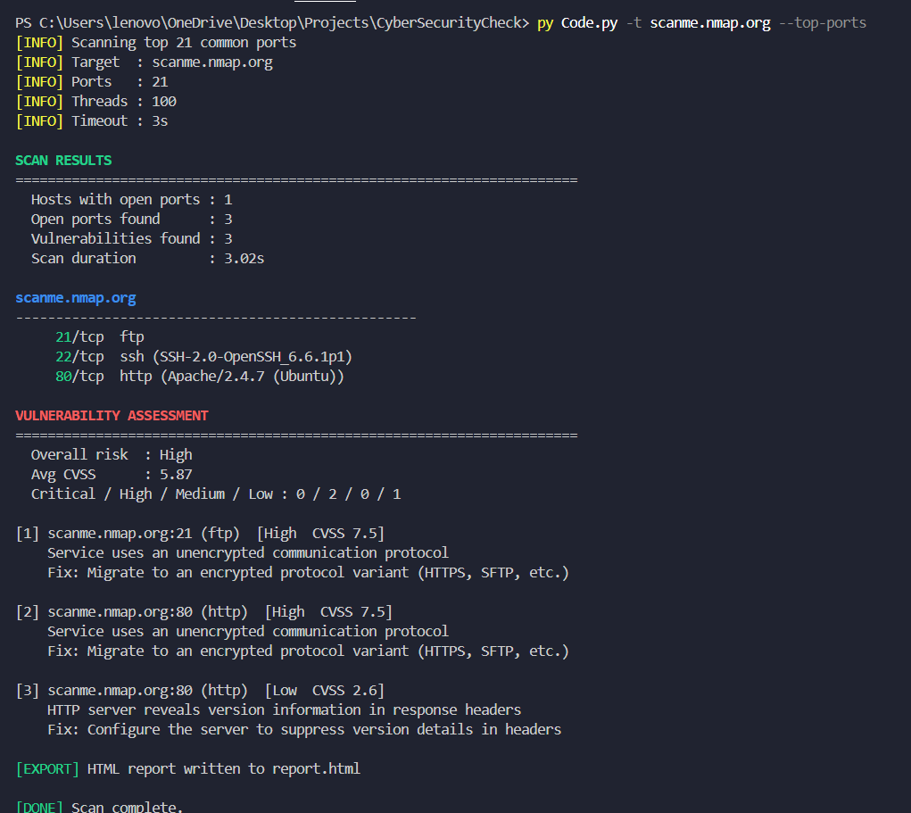
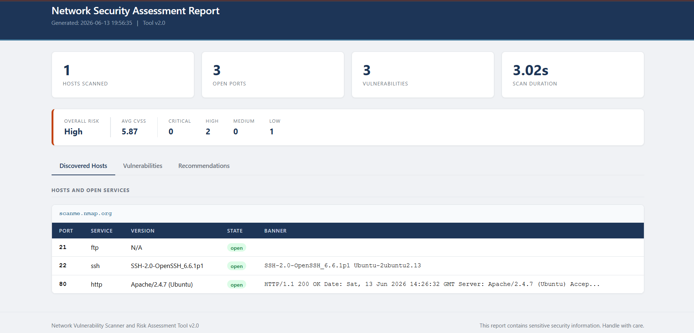

# Network Vulnerability Scanner

A Python-based network reconnaissance and vulnerability assessment tool designed to automate host discovery, port scanning, service fingerprinting, and vulnerability identification. The scanner generates professional reports with risk scoring and export capabilities for security analysis and assessment workflows.

## Features

* Multi-threaded port scanning for single hosts and CIDR network ranges
* Banner grabbing and service version fingerprinting
* SSL/TLS configuration and cipher strength analysis
* Detection of common security weaknesses, including:

  * Unencrypted protocols (FTP, Telnet, HTTP, POP3, IMAP)
  * Server version disclosure
  * Exposed database and remote access services
  * Weak SSL/TLS cipher suites
* CVSS-based severity scoring and overall risk classification
* Automatic generation of HTML security reports
* JSON and CSV export support
* Configurable thread count and connection timeouts

## Tech Stack

* Python 3
* socket
* ssl
* threading
* concurrent.futures
* json
* csv
* argparse
* ipaddress

## Usage

### Scan a Single Host

```bash
python Code.py -t scanme.nmap.org --top-ports
```

### Scan a Specific Port Range

```bash
python Code.py -t 192.168.1.1 -p 1-1000
```

### Scan a Subnet and Export JSON

```bash
python Code.py -t 192.168.1.0/24 --top-ports -o results.json
```

### Full Port Scan with CSV Export

```bash
python Code.py -t 192.168.1.1 -p 1-65535 --csv ports.csv
```

## Command-Line Options

| Flag          | Description                                     |
| ------------- | ----------------------------------------------- |
| `-t`          | Target IP address, hostname, or CIDR range      |
| `-p`          | Port range (for example: `1-1000`, `22,80,443`) |
| `--top-ports` | Scan the 20 most common ports                   |
| `--threads`   | Number of worker threads (default: `100`)       |
| `--timeout`   | Connection timeout in seconds (default: `3`)    |
| `-o`          | Export results to JSON                          |
| `--csv`       | Export results to CSV                           |
| `-v`          | Enable verbose output                           |

## Reports

Each scan automatically generates a fresh `report.html` file containing:

* Scan summary and risk dashboard
* Open ports and detected services
* Banner and version information
* Identified vulnerabilities with CVSS scores
* Prioritized remediation recommendations

## Output Screenshots

### Scan Results



### Generated HTML Report



## Responsible Use

This project is intended solely for educational purposes and authorized security assessments. Only scan systems that you own or have explicit permission to test. Unauthorized network scanning may violate laws and organizational policies.
