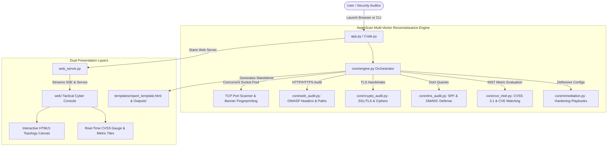

# 🛡️ AegisScan v3.0 Pro
### Autonomous Multi-Vector Network & Web Cybersecurity Assessment Platform
*Final Year Capstone Project in Cybersecurity & Network Defense*

---

## 📋 Executive Overview & Abstract

**AegisScan** is an academic-grade, multi-vector cybersecurity assessment and reconnaissance platform designed to automate vulnerability identification, quantitative risk scoring, and defensive remediation across networked hosts and web applications.

Unlike conventional basic port scanners that rely on static heuristics, **AegisScan** operates in **real time** against live user targets with **zero hardcoded mock data**. It orchestrates concurrent TCP socket reconnaissance, OWASP Top 10 web application security header verification, deep SSL/TLS cryptographic handshakes, and DNS email-spoofing defense audits (SPF/DMARC), scoring all findings against the **NIST Common Vulnerability Scoring System (CVSS v3.1)** standard.

The platform provides a dual interface:
1. **Interactive Tactical Cyber Console**: A high-tech, dark-mode operations dashboard featuring real-time Server-Sent Events (SSE) telemetry, an interactive HTML5 Canvas **Attack Surface Network Topology Graph**, dynamic CVSS risk dials, and copy-pasteable remediation playbooks.
2. **Automated CLI Auditor**: A headless, high-throughput command-line interface with formatted terminal tables and automated HTML, JSON, and CSV export.

---

## 🏛️ System Architecture


```mermaid
flowchart TD
    User([User / Security Auditor]) -->|Launch Browser or CLI| Launcher[app.py / Code.py]
    
    subgraph CoreEngine [AegisScan Multi-Vector Reconnaissance Engine]
        Launcher --> Engine[core/engine.py Orchestrator]
        Engine -->|Concurrent Socket Pool| PortScanner[TCP Port Scanner & Banner Fingerprinting]
        Engine -->|HTTP/HTTPS Audit| WebAuditor[core/web_audit.py: OWASP Headers & Paths]
        Engine -->|TLS Handshake| CryptoAuditor[core/crypto_audit.py: SSL/TLS & Ciphers]
        Engine -->|DoH Queries| DnsAuditor[core/dns_audit.py: SPF & DMARC Defense]
        Engine -->|NIST Metric Evaluation| CveIntel[core/cve_intel.py: CVSS 3.1 & CVE Matching]
        Engine -->|Defensive Configs| Remediation[core/remediation.py: Hardening Playbooks]
    end

    subgraph Interfaces [Dual Presentation Layers]
        Launcher -->|Starts Web Server| WebServer[web_server.py]
        WebServer -->|Streams SSE & Serves| WebUI[web/ Tactical Cyber Console]
        WebUI --> Canvas[Interactive HTML5 Topology Canvas]
        WebUI --> HUD[Real-Time CVSS Gauge & Metric Tiles]
        Engine -->|Generates Standalone| Reports[templates/report_template.html & Outputs/]
    end
```

---

## 🔬 Multi-Vector Assessment Capabilities

### 1. High-Concurrency TCP Reconnaissance & Latency Tracking
- Multi-threaded TCP Connect scanner with configurable worker pools (up to 100 threads).
- Socket round-trip latency measurement in milliseconds (`ms`).
- Smart service fingerprinting across 80+ standard ports (SSH, HTTP/HTTPS, FTP, SMTP, MySQL, Redis, PostgreSQL, RDP, etc.).
- Categorized scanning profiles: `Quick` (top 20), `Web & Cloud`, `Databases`, `Infrastructure`, `Standard` (top 100), and `Custom Range`.

### 2. OWASP Web Application & Security Headers Audit
- Live evaluation of essential defensive headers:
  - `Strict-Transport-Security` (HSTS)
  - `Content-Security-Policy` (CSP)
  - `X-Frame-Options` (Clickjacking mitigation)
  - `X-Content-Type-Options` (MIME sniffing defense)
  - `Referrer-Policy` & `Permissions-Policy`
- Server software version disclosure (`Server`, `X-Powered-By`, `X-AspNet-Version`).
- Concurrent probing for exposed sensitive files and administrative panels:
  - `/.env` (Database credentials and secrets)
  - `/.git/HEAD` (Source code repository exposure)
  - `/robots.txt`, `/sitemap.xml`, `/.well-known/security.txt`
  - `/backup.zip`, `/server-status`
- CORS misconfigurations (`Access-Control-Allow-Origin: *`) and missing cookie security flags (`Secure`, `HttpOnly`, `SameSite`).

### 3. Cryptographic SSL/TLS Deep-Dive
- Full X.509 certificate extraction: Subject Common Name, Issuer, Organization, and Subject Alternative Names (SANs).
- Expiration countdown tracking (flags expired certificates or renewals due within 14–30 days).
- Self-signed certificate detection.
- Negotiated protocol audit (flags deprecated TLS 1.0 and TLS 1.1 per RFC 8996).
- Cipher suite key-length analysis (<128 bit weak ciphers) and Perfect Forward Secrecy (PFS) validation.

### 4. DNS Infrastructure & Email Spoofing Defense
- Dynamic DNS record queries (A, AAAA, MX, TXT) via DNS-over-HTTPS (DoH).
- **Sender Policy Framework (SPF) Verification**: Detects missing SPF or overly permissive mechanisms (`+all`, `?all`, `~all` vs strict `-all`).
- **DMARC Anti-Phishing Verification**: Evaluates policy enforcement at `_dmarc.<domain>` (detects vulnerable `p=none` configurations that allow unauthorized email spoofing).

### 5. NIST CVSS v3.1 Mathematical Risk Engine
- Implements the official FIRST.org **NIST CVSS v3.1** specification.
- Dynamically computes:
  $$\text{ISS} = 1 - [(1 - C) \times (1 - I) \times (1 - A)]$$
  $$\text{Impact} = 6.42 \times \text{ISS} \quad (\text{Scope Unchanged})$$
  $$\text{Exploitability} = 8.22 \times AV \times AC \times PR \times UI$$
- Generates standardized vector strings (e.g., `CVSS:3.1/AV:N/AC:L/PR:N/UI:N/S:U/C:H/I:H/A:H`).

### 6. Actionable Remediation Playbooks
- Generates concrete, production-ready configuration code for immediate copy-paste deployment:
  - Hardened **Nginx** server blocks with modern SSL ciphers and security headers.
  - Hardened **Apache** `.htaccess` / virtual host directives.
  - Linux `iptables` and `ufw` firewall rules restricting exposed management ports.
  - Standard-compliant SPF and DMARC DNS TXT resource records.

---

## 🚀 Quick Start & Installation

### Prerequisites
- Python 3.8+ (Compatible with Python 3.10, 3.11, 3.12, and 3.13)
- No complex third-party system dependencies required.

### 1. Launch Interactive Web Console (Recommended)
Simply execute the main entry point:
```bash
python app.py
```
*(Or `python Code.py`)*

The console will automatically launch on `http://127.0.0.1:5000` and open your default browser.

### 2. Command-Line Interface (CLI Mode)

#### Quick Reconnaissance on Domain or IP:
```bash
python app.py -t scanme.nmap.org --cli
```

#### Web Application & OWASP Audit:
```bash
python app.py -t example.com --profile web --cli
```

#### Scan Specific Port Range with JSON and HTML Exports:
```bash
python app.py -t 192.168.1.1 -p 22,80,443,3306,8080 --cli -o scan.json --report report.html
```

#### Scan Localhost:
```bash
python app.py -t 127.0.0.1 -p 1-1000 --threads 60 --cli
```

---

## 🖥️ Interactive Console Features

- **Interactive Attack Surface Topology**: HTML5 Canvas graph rendering the central host, radiating radar pulses, open port nodes color-coded by service, and vulnerability satellite badges with spring-physics and drag-and-drop interaction.
- **Real-Time Live Socket Stream**: Server-Sent Events (SSE) stream raw packet and socket handshake events directly to an in-browser cyber terminal.
- **CVSS Score Dial**: Circular animated gauge reflecting quantitative target security posture.
- **One-Click Audit Exports**: Instant export to executive HTML report, JSON dataset, CSV port table, or browser print/PDF.

---

## 📂 Project Structure

```
CyberSecurityCheck/
├── app.py                      # Primary launcher (Web GUI default, CLI with --cli)
├── Code.py                     # Backward-compatible entry point
├── web_server.py               # Asynchronous SSE & REST backend server
├── core/
│   ├── __init__.py
│   ├── engine.py               # Concurrency engine, latency & port scanner
│   ├── web_audit.py            # OWASP headers, sensitive paths, CORS & cookies
│   ├── crypto_audit.py         # SSL/TLS certificate chains & cipher audit
│   ├── dns_audit.py            # DNS over HTTPS, SPF & DMARC policy check
│   ├── cve_intel.py            # NIST CVSS 3.1 scoring & CVE correlation
│   └── remediation.py          # Hardening config generator (Nginx, Apache, etc.)
├── web/
│   ├── index.html              # Tactical Cyber Console UI
│   ├── style.css               # Bespoke high-tech dark CSS
│   └── app.js                  # Canvas topology graph & SSE client
├── templates/
│   └── report_template.html    # Standalone printable report template
├── assets/
│   └── aegis_emblem.jpg        # Tactical cyber security shield emblem
└── Outputs/                    # Default folder for audit exports
```

---

## 🎓 Academic Presentation & Viva Highlights

When presenting this project for final-year evaluation:
1. **Dynamic Architecture**: Emphasize that all checks execute live network sockets against user-provided targets—zero mock or hardcoded datasets.
2. **Multi-Vector Breadth**: Highlight that the tool evaluates Network (L4), Transport Security (TLS/SSL), Web Application (L7 OWASP), and Domain Identity (DNS/DMARC).
3. **Formal Risk Methodology**: Show the mathematical implementation of the NIST CVSS v3.1 base score formula and vector strings.
4. **Remediation Actionability**: Demonstrate the auto-generated Nginx, Apache, and firewall playbooks that empower administrators to remediate identified flaws immediately.

---

## ⚖️ Responsible Use & Disclaimer
*AegisScan is designed strictly for educational, research, and authorized penetration testing / defensive assessment purposes. Do not execute scans against systems or networks without explicit authorization.*
